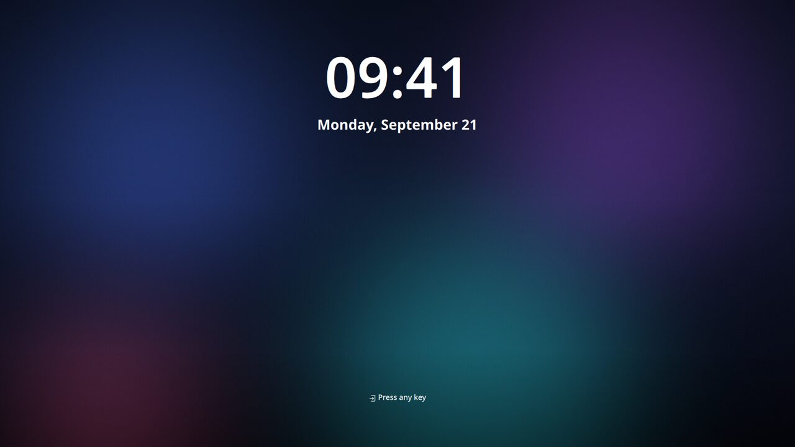
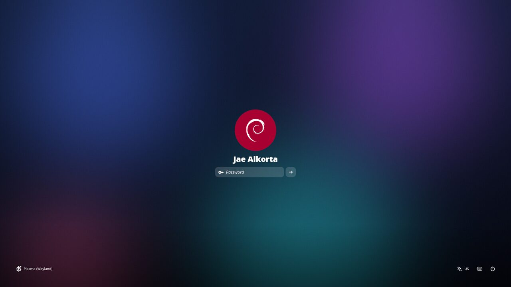
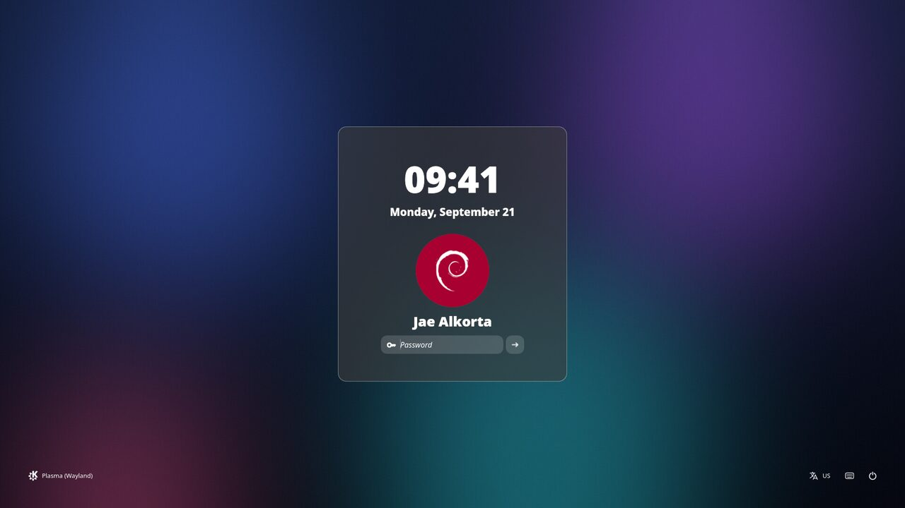
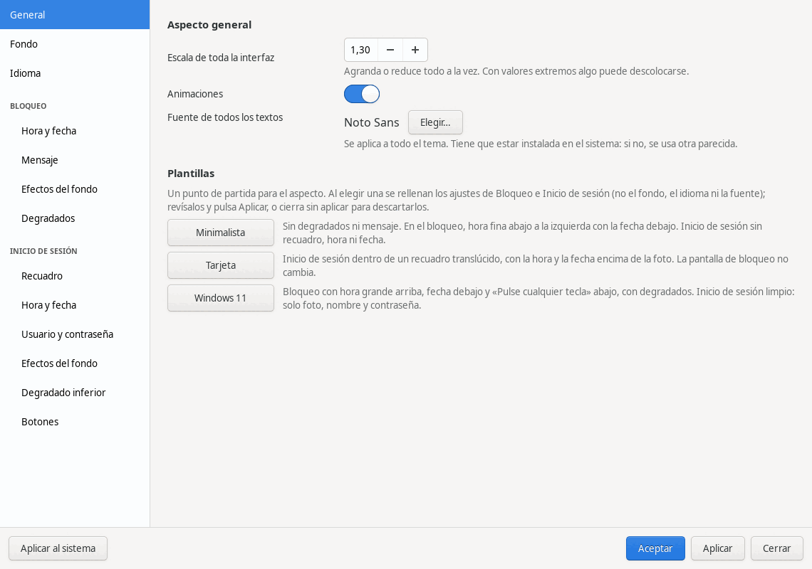

# Velo

**A login screen for KDE Plasma (SDDM) with a Windows 11-style lock screen: big clock, soft gradients, a video, an image or a slideshow as background — and a graphical app to change everything without editing text files.**

*[Leer en español](README.es.md)*



| Login screen | Login screen, "Card" preset |
|---|---|
|  |  |

*Screenshots taken with the theme's own test mode (`sddm-greeter-qt6 --test-mode`) over a generated wallpaper.*

## Features

- **Lock screen** in the style of Windows 11: large clock and date, "Press any key" message, and soft dark gradients at the top and bottom so the white text is readable over any background (no drop shadows).
- **Login screen** without clutter: photo, name and password field, with session, keyboard layout, on-screen keyboard and power buttons.
- **Backgrounds:** an image, a video (mp4, webm, mkv…) or a folder of images that change by themselves. Blur, brightness and saturation per screen.
- **Configuration app** ("Configuraciones de VELO", in Spanish): General, Background, Language, and a group of pages for each screen (Lock / Login). It writes the config file for you, always keeping a backup.
- **Presets:** Windows 11, Card, Minimalist.
- **43 languages** for the theme's own texts (date and day names come from Qt). The translations are machine-written and unreviewed by native speakers: expect mistakes.
- **Modular:** the pieces (`Scrim`, `LoginCard`, `LoginHeader`…) are separate QML files, so changing one does not break another.

## Requirements

- SDDM 0.21 or newer with Qt 6, and KDE Plasma.
- For the install script: Debian, Ubuntu or a derivative (`apt`). On other distributions copy the theme by hand (see *How it works*).
- For the app: Python 3 with GTK 3 (`python3-gi`, `gir1.2-gtk-3.0`) and `ffmpeg` (video thumbnails).

Tested only on one machine: Debian 13, KDE Plasma 6.3, Wayland.

## Install

```bash
git clone https://github.com/jaealkorta/Velo.git
cd Velo
./test.sh                  # preview the theme without installing anything
./install.sh --simular     # show what the installer would do (dry run)
./install.sh               # install and activate
./gui/instalar_app.sh      # optional: put the configuration app in the applications menu
```

The installer installs missing packages, copies the theme to `/usr/share/sddm/themes/velo` and activates it with a separate file, `/etc/sddm.conf.d/velo.conf`. It does not touch KDE's own configuration.

**Uninstall / roll back:** `./install.sh --quitar`. If the login screen does not show up, from another console (`Ctrl+Alt+F3`): `sudo rm /etc/sddm.conf.d/velo.conf`.

> Always run `./test.sh` before rebooting. If the theme is broken you could end up with a broken login screen.

## The configuration app

Open it from the menu or with `./velo-gui`.



- **Apply** saves to the theme folder (a backup of the config is made each time).
- **Apply to system** copies the theme to the folder SDDM reads. Changing it needs administrator rights, so the app first says so, then opens a terminal where you type your password; the terminal closes by itself. Nothing runs as root except `tar`, `mv` and similar system tools reading a package the app prepares.
- Backgrounds are copied into the theme's `backgrounds/` folder: the login screen cannot read your home directory.

Everything the app does ends up in one text file, `configs/default.conf`, which you can also edit by hand. `configs/presets/` holds the presets (partial config files).

## Backgrounds

Images (jpg, png) and videos (mp4, webm, mkv, mov, avi). For a login screen a light video works best: 1080p, 30 fps, a few megabytes. **This repository ships no videos or wallpapers** except a fallback image (`backgrounds/default.jpg`): bring your own.

## How it works

- `Main.qml` builds the two screens and the background; `components/` has the pieces.
- `configs/default.conf` is the configuration; only the keys read in `components/Config.qml` have effect.
- `gui/` is the app (Python + GTK 3). Tests: `python3 gui/tests/test_basico.py` (the window tests need a virtual display, see the header of each file in `gui/tests/`).
- To install by hand: copy this folder (without `gui/`, `docs/` and the scripts) to `/usr/share/sddm/themes/velo`, set `Current=velo` in a file under `/etc/sddm.conf.d/`, and make sure the greeter has `QML2_IMPORT_PATH=/usr/share/sddm/themes/velo/components/` and `QT_IM_MODULE=qtvirtualkeyboard` in `GreeterEnvironment`.

## How it was made

Velo is a personal project by Jae Alkorta. **All the changes on top of SilentSDDM were written 100 % by Claude** (Anthropic's AI assistant, through Claude Code): the QML changes, the configuration app, the installer, the presets, the translations, the tests and this documentation. Jae set the design, tested it on their own laptop and approved each step. The base theme is the work of uiriansan and its contributors and is not part of that claim.

## Credits and license

Velo is a modified version of [SilentSDDM](https://github.com/uiriansan/SilentSDDM) 1.5.0 by uiriansan, and uses the same license: **GPL-3.0-or-later**. You can use, change and share it as long as you keep that license and the credit to the original author. See `NOTICE` and `LICENSE`. The fonts in `fonts/` (Red Hat) come with their own SIL Open Font License (`fonts/OFL.txt`).
